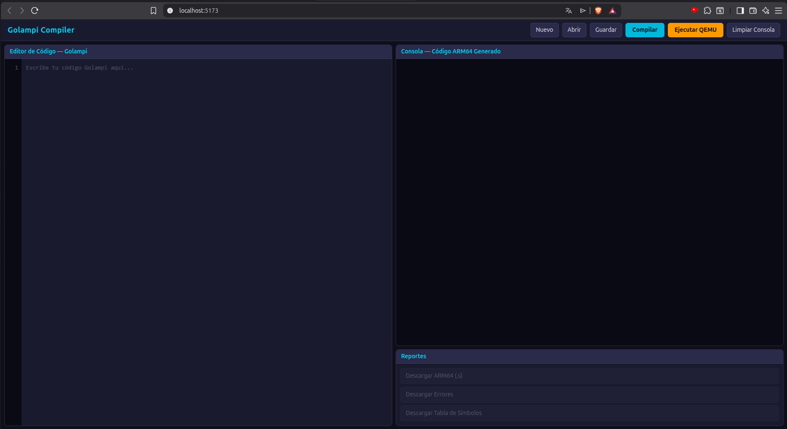
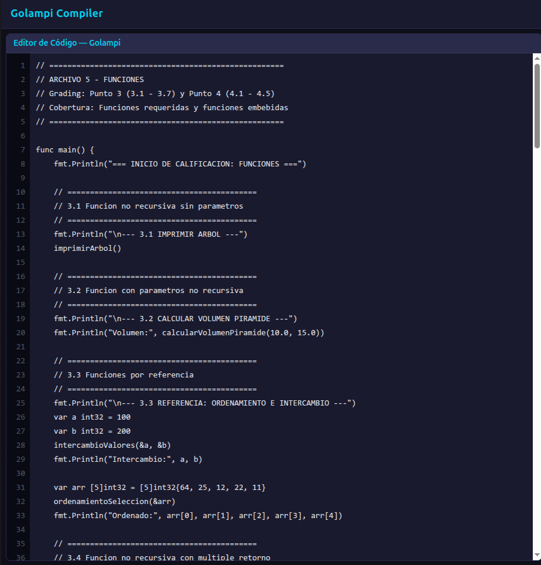
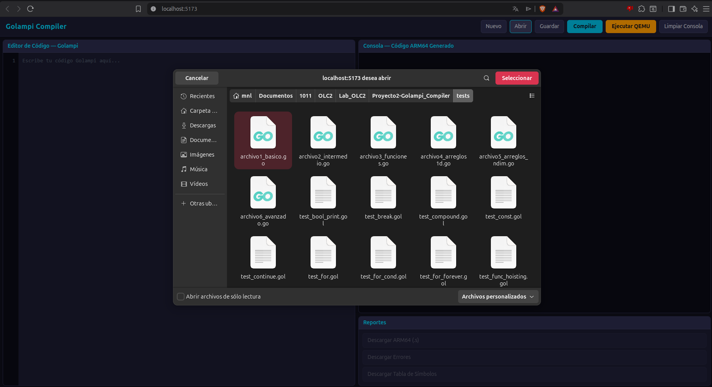
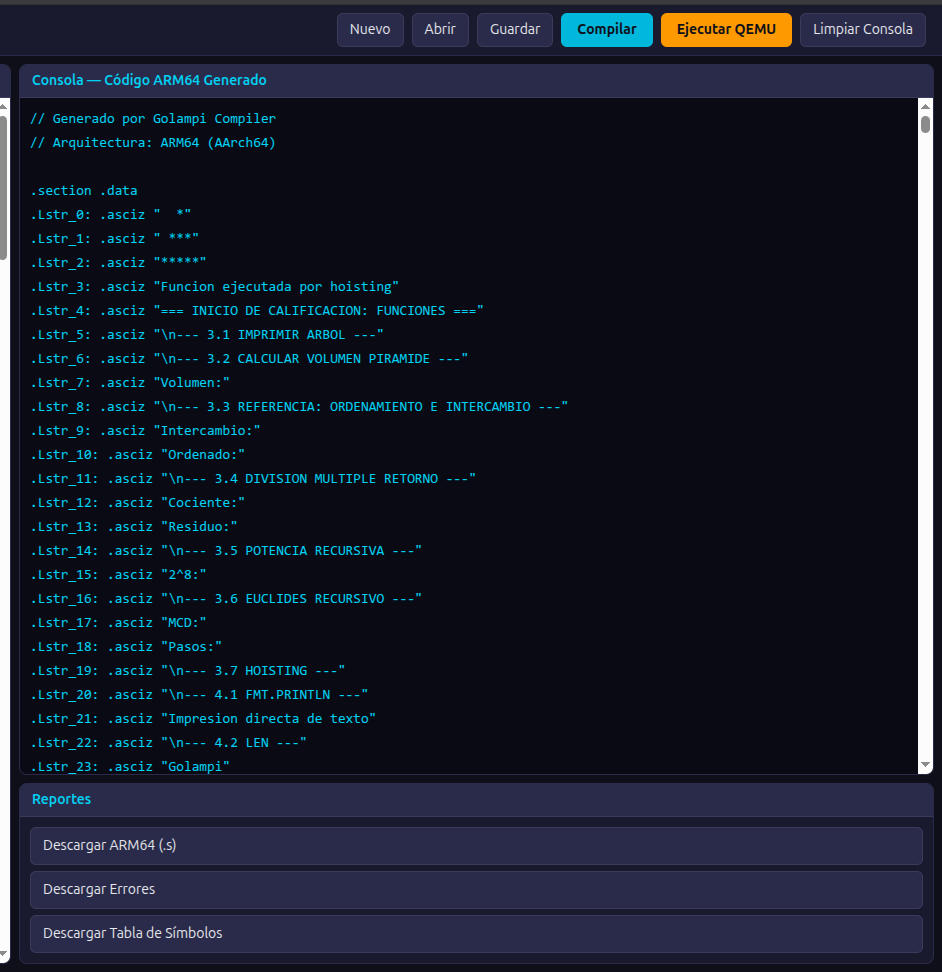
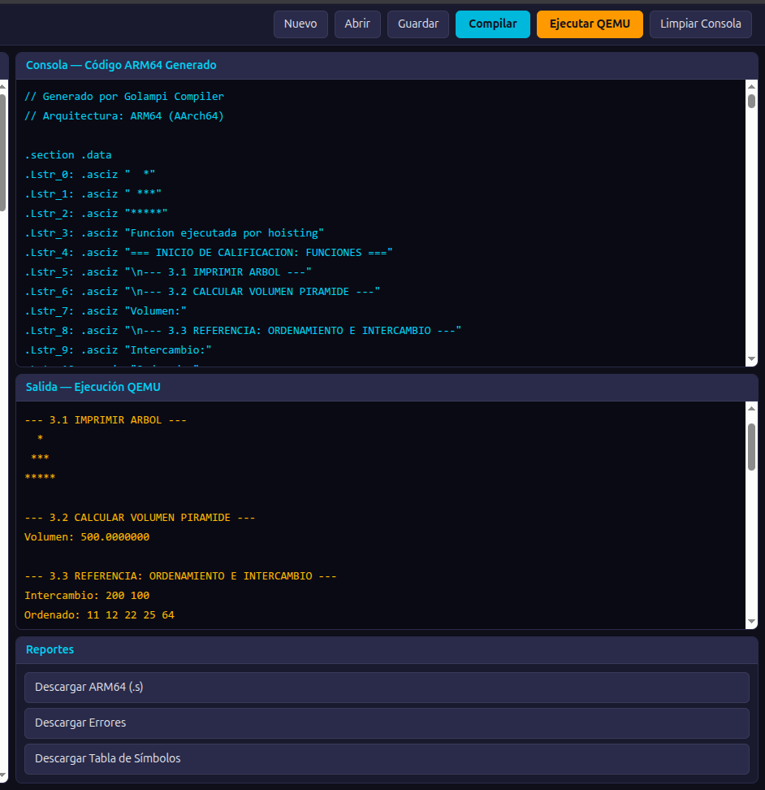
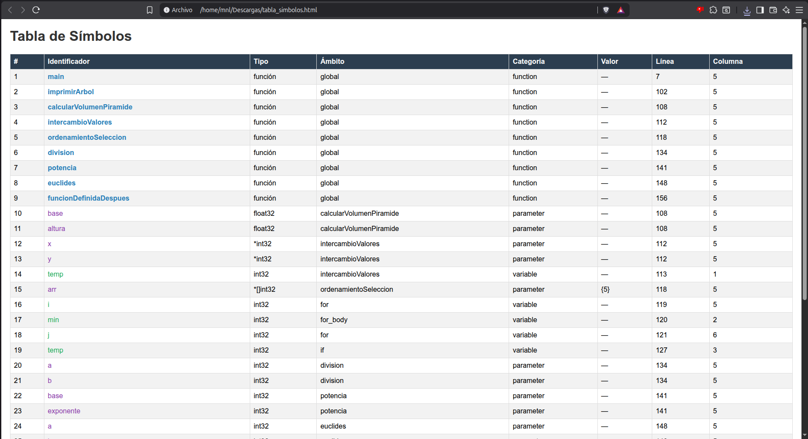
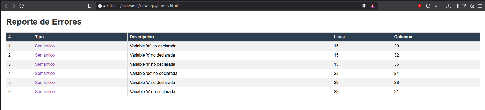
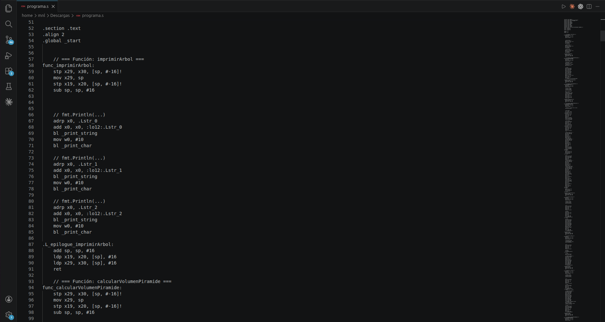

# Manual de Usuario — Golampi Compiler

## 1. Requisitos del Sistema

* Sistema operativo: Linux (Ubuntu 24.04 recomendado), macOS o Windows con WSL
* PHP 8.3 o superior
* Composer
* Node.js v20 o superior
* ANTLR 4.13.1
* Java JDK
* QEMU (qemu-aarch64)
* Toolchain ARM64:

  * aarch64-linux-gnu-as
  * aarch64-linux-gnu-ld
* Navegador web moderno (Chrome, Firefox, Edge)

---

## 2. Instalación

### 2.1 Clonar el repositorio

```bash
git clone <URL_DEL_REPOSITORIO>
cd Proyecto2-Golampi_Compiler
```

### 2.2 Instalar dependencias del backend

```bash
cd backend
composer install
```

### 2.3 Generar parser de ANTLR

> Ejecutar únicamente si es la primera vez o si se realizaron cambios en la gramática.

```bash
cd backend
antlr -Dlanguage=PHP -visitor Grammar/Golampi.g4
```

### 2.4 Instalar dependencias del frontend

```bash
cd frontend
npm install
```

---

## 3. Ejecución del Sistema

Para ejecutar correctamente el sistema se necesitan dos terminales abiertas.

### Terminal 1 — Backend

```bash
cd backend
php -S localhost:8080
```

Salida esperada:

```bash
PHP Development Server started
```

### Terminal 2 — Frontend

```bash
cd frontend
npm run dev
```

Salida esperada:

```bash
VITE ready
```

### 3.1 Acceso a la aplicación

Abrir el navegador en:

```
http://localhost:5173
```

---

---

---

# 4. Uso de la Interfaz

La interfaz está compuesta por:

* Editor de código
* Consola de compilación
* Consola de ejecución QEMU
* Panel de reportes
* Barra de acciones

---

## 4.1 Editor de código

En esta sección el usuario puede escribir código fuente en lenguaje Golampi.

Funciones:

* Crear nuevo código
* Editar código existente
* Visualizar contenido cargado

---

---

---

## 4.2 Abrir archivo

El botón **Abrir** permite seleccionar archivos `.gol`, `.go` o `.txt`.

Pasos:

1. Presionar botón **Abrir**
2. Seleccionar archivo
3. El contenido se carga automáticamente

---

---

---

## 4.3 Guardar archivo

El botón **Guardar** descarga el contenido actual del editor como archivo `.gol`.

---

## 4.4 Compilar código

El botón **Compilar** ejecuta automáticamente las siguientes fases:

1. Análisis léxico
2. Análisis sintáctico
3. Análisis semántico
4. Generación de código ARM64
5. Generación del archivo `.s`

Si el código es correcto:

* Se genera código ensamblador ARM64
* Se habilitan reportes

Si existen errores:

* Se genera reporte de errores

---

---

---

# 5. Ejecución del código ARM64 con QEMU

Después de generar el archivo ensamblador, el sistema permite ejecutar el binario utilizando QEMU.

Proceso interno:

```bash
aarch64-linux-gnu-as salida.s -o salida.o
aarch64-linux-gnu-ld salida.o -o salida
qemu-aarch64 ./salida
```

Esto permite validar que el código generado por el compilador funcione correctamente.

---

---

---

# 6. Reportes

El sistema genera automáticamente reportes importantes durante el proceso.

---

## 6.1 Reporte de tabla de símbolos

Este reporte contiene:

* Identificador
* Tipo
* Ámbito
* Valor
* Línea
* Columna

---

---

---

## 6.2 Reporte de errores

Este reporte registra:

* Errores léxicos
* Errores sintácticos
* Errores semánticos

Información mostrada:

* Tipo
* Descripción
* Línea
* Columna

---

---

---

## 6.3 Descarga de código ARM64

El sistema permite descargar el archivo generado con extensión `.s`.

Este archivo contiene todo el código ensamblador producido por el compilador.

---

---

---

# 7. Ejemplo de flujo completo de uso

1. Ingresar al sistema
2. Crear o abrir archivo
3. Escribir código Golampi
4. Compilar código
5. Revisar código ARM64 generado
6. Ejecutar binario con QEMU
7. Revisar tabla de símbolos
8. Revisar errores
9. Descargar archivo `.s`

---

# 8. Solución de Problemas

| Problema                      | Solución                                               |
| ----------------------------- | ------------------------------------------------------ |
| Error de conexión con backend | Verificar que PHP esté ejecutándose                    |
| Frontend no inicia            | Verificar `npm install`                                |
| Error con ANTLR               | Regenerar parser                                       |
| Error con QEMU                | Verificar instalación de `qemu-aarch64`                |
| Error en ensamblador ARM64    | Verificar instalación de `aarch64-linux-gnu-as` y `ld` |

---

# 9. Consideraciones Finales

El compilador Golampi implementa un flujo completo de compilación:

* Análisis léxico
* Análisis sintáctico
* Análisis semántico
* Generación de código ARM64
* Ensamblado
* Ejecución mediante QEMU

Este sistema permite validar programas escritos en Golampi y generar código ensamblador real para arquitectura ARM64.
